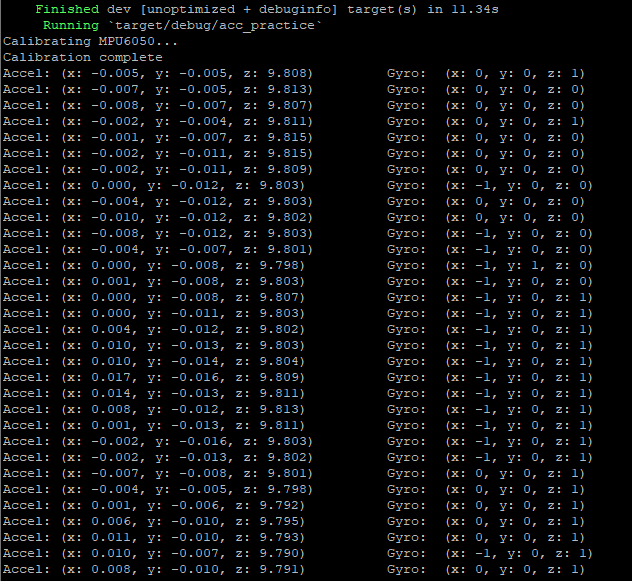

# GPS Spoofing Detection

This project provides a way to detect GPS spoofing without additional hardware
that isn't already present on most GPS-enabled devices (eg. an accelerometer/gyroscope).
The way it does this is by integrating the acceleration of the device to constantly 
provide an estimated velocity and position based on the previous information. If at 
any point, the time, date, or location doesn't match what it should, then spoofing is highly likely and can be reported.

This program runs on a Raspberry Pi Zero, with a Neo-6M GPS module and a GY-521 
accelerometer/gyroscope. The GPS module is connected to the board via the serial 
connection on UART pins (GPIO pins 14 and 15). The accelerometer/gyro is connected to 
the Pi on the I2C pins (GPIO pins 2 and 3). 

This is an example of the GPS data I can recieve (this is the unparsed and parsed data
combined. There is a lot of data with the unparsed, and it is somewhat hard to visualize).

This is an example of the accelerometer data I can parse from the module. This is before
calibrating the data and converting it to G's.

To build and run the project, place the spoofing_detection crate where you like on your computer and wire the processor and sensors as described above and seen in the photo. In a terminal, navigate into the spoofing_detection crate and run `cargo run`.
This will build the project and begin the spoofing detection program. When spoofing is detected, a message is printed to the console. Alternate behavior can be added to customize the defensive behavior.

A clip and explanation of the project can be found [here](https://youtu.be/3lkAla2swwI)
Or copy and paste this link.
https://youtu.be/3lkAla2swwI